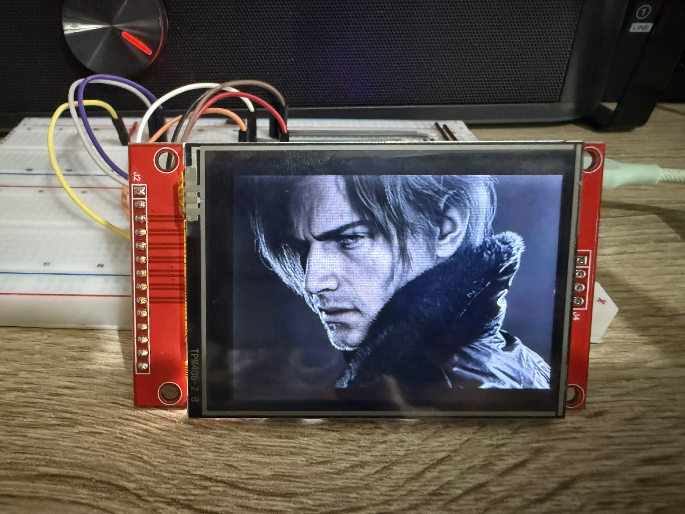

<div align="center">

# ESP32 ILI9341 Display Driver

A bare-metal SPI display driver for the ILI9341 2.8" TFT screen, written in C on top of ESP-IDF.



</div>

---

## What this is

This is a from-scratch driver for the ILI9341 display controller. No graphics libraries, no HAL wrappers. Just the ESP32 talking directly to the display over SPI.

The driver lives in `components/ili9341/` as a proper ESP-IDF component with a clean public API. Your application code in `main.c` never touches a register or a GPIO directly.

---

## Wiring

| Display Pin | ESP32 GPIO |
|-------------|------------|
| MOSI        | 23         |
| CLK         | 18         |
| CS          | 5          |
| DC          | 2          |
| RST         | 4          |
| VCC         | 3.3V       |
| GND         | GND        |

---

## Building and flashing

```bash
idf.py build
idf.py -p COM5 flash monitor
```

---

## Displaying an image

Images need to be converted to RGB565 format, which is what the display understands. A Python script is included to handle this.

**1. Install Pillow**
```bash
pip install Pillow
```

**2. Convert your image**
```bash
python tools/img2c.py photo.jpg main/image.h
```

This resizes your image to 240x320 and generates a C header file with the pixel data ready to flash.

For landscape orientation (320x240):
```bash
python tools/img2c.py photo.jpg main/image.h 320 240
```

**3. Include it in main.c**
```c
#include "image.h"

ili9341_set_rotation(ILI9341_ROTATION_90);
ili9341_draw_image(0, 0, IMAGE_WIDTH, IMAGE_HEIGHT, image);
```

---